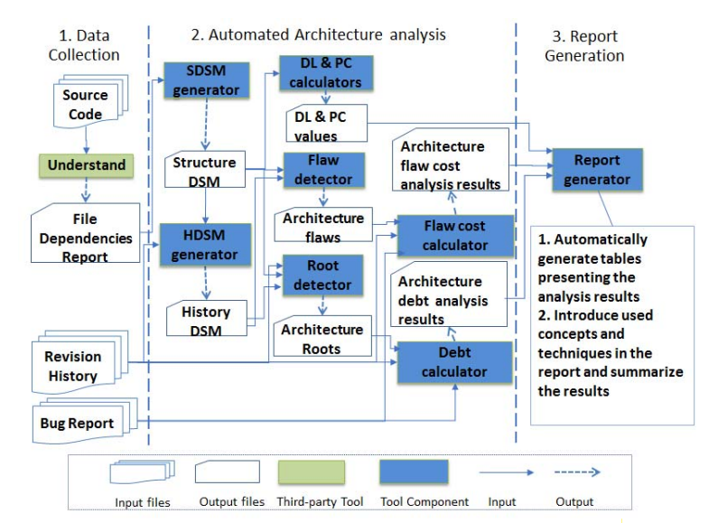

# ASE 论文整理

## 1. Introduction

开发团队需要量化项目的维护问题和技术债，来确定是否需要重构，这是比较困难的事情。论文对此使用三种自动架构分析(automated architecture analysis) 和DV8，在ABB上的8个大项目测试，并将结果反馈回项目开发团队，举行采访等等，来说明其是否有用。  
第一个技巧：用架构维护指标度量(architecture measurement)，其包括decoupling level(DL)和propagation cost(PC), 第二个技巧：架构缺点检测(architecture flaw analysis)，量化bug和change，通过design structure matrix可视化。第三个技巧：架构根分析(architecture root analysis), Design rule space(DRSpace):一些用于实现某模式，特征等的架构关联文件，architecture root: 把系统里最易错文件集合起来的DRSpace。

## 2. Research Questions

1. DV8是否有助于管理层与开发层交流？
2. 和其他公司内部项目和一些基准模式比，DV8是否有助于从事者理解其系统维护性  
3. DV8是否有助于开发者准确找到有严重设计错误的文件(hotspot)

## 3. Procedure

如下：

## 4. Architecture measurement  

测量DL和PC，各个项目的DL和PC，可看出DL和PC负相关，且DL越高，PC越低，项目维护性越高

## 5. Architecture flaw analysis

一个是flaw detector，生成DSM，一个是flaw cost calculator,量化维护费用

## 6. Architecture root analysis

未细看

后面是作者的一些总结，未细看，重要的是第三部分Procedure，要更深入了解architecture flaw 和architecture root , DSM等可以看论文具体部分

