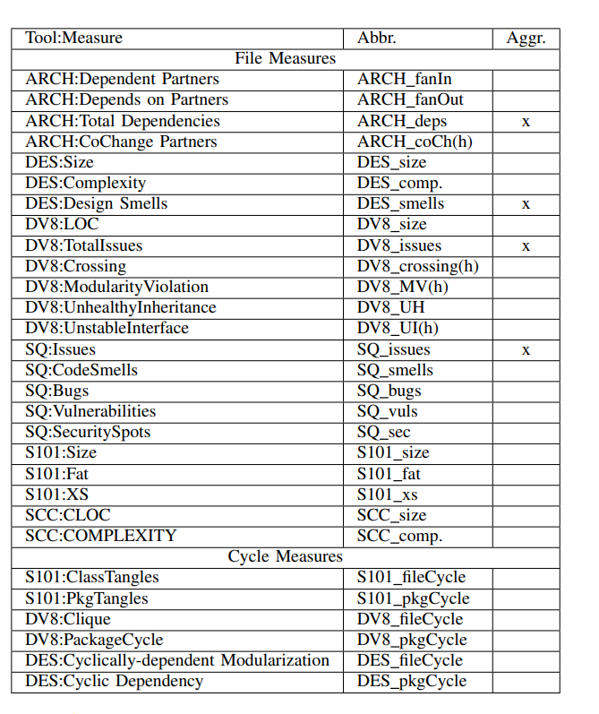
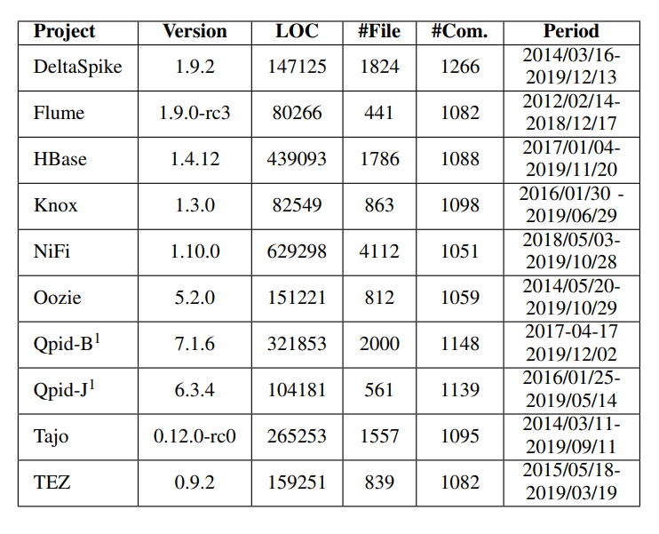
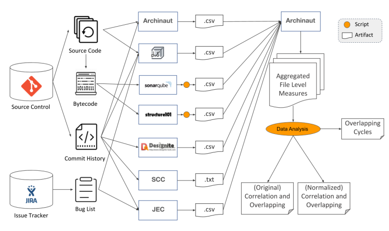
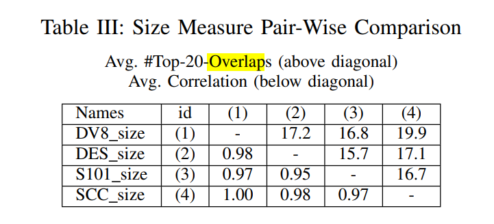
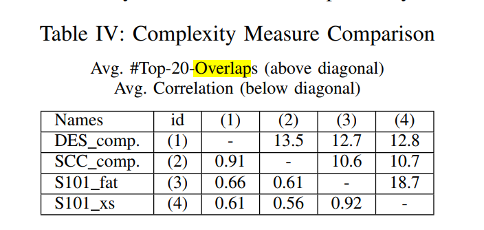
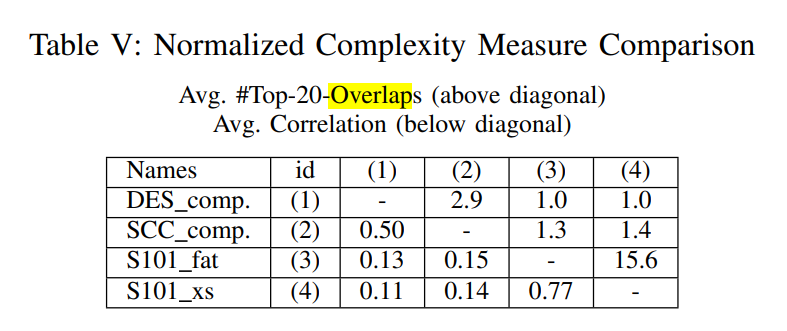
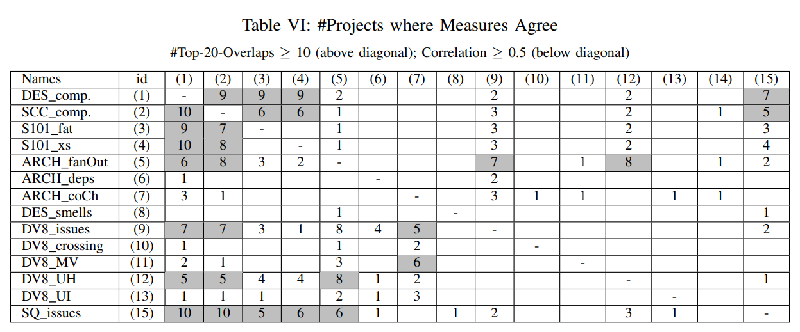
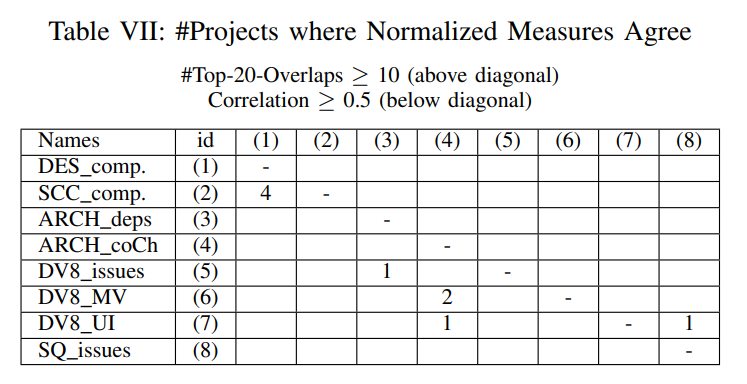
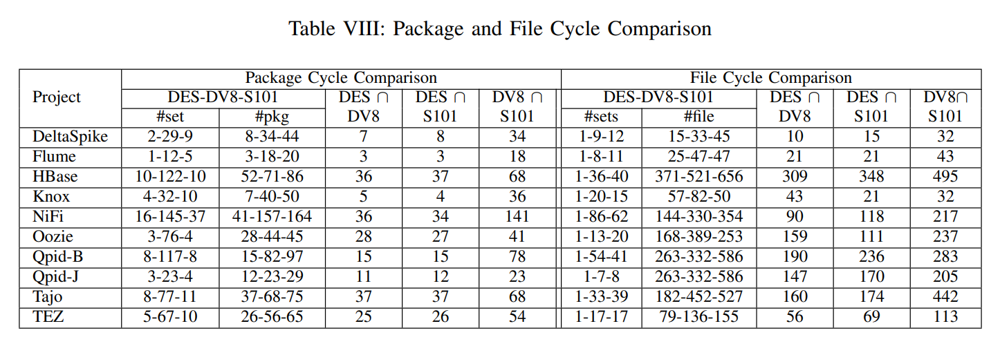

# Benchmark  论文整理

## 1. Introduction

**论文背景**  
在软件开发中，不同tool对检测not-quite-right的定义不同,技术债不一定相同。不同tools对类似文件问题的报告是否相同，那些tool有更可能找出可能导致大问题的技术债并不确定。

**extrinsic maintainability measures**  
版本修改数，bug修复数，版本修改的代码行数，修复bug的代码行数

**常见软件measure(度量标准)**  
Line of code, complexity, cycles,cycle包含file和package两个方面

**两个概念**
co-change(historical)  
code-based(structural)

## 2. Research Questions

1. 通过对类似问题文件的报告，不同tool的检测效果相符合程度为多少？
2. 对一些常见问题，不同tool检测是否一致?
3. tool检测到的问题是否真包含技术债，

## 3. Empirical Study

**A. Tool Selection**  
选择软件的标准：易获得，可以在文件层面分析，结果机器可读（文件是任务分配的最小单位，与maintenance cost有关)  

论文所选的tool如下

(h)表示此measure包含了一个计划提交历史的信息， 第三列表示此measure是否是其他measure的汇总  
Security Hotspot（安全热点）：需要审查的安全敏感代码段

**B. Subject Selection**  
选择project的标准：至少1000次提交，源代码主要为Java。从20-MAD dataset中寻找

论文所选的subject如下

"#Com" 为 commit数目

**C. Data Processing**

不同的tool有不同的输入，有不同的输出，Archinaut(ARCH)既是measure producer的一部分，也是不同tool结果整合的工具  
SCC是用来测量代码大小和复杂度的一个工具（可以认为是准确的）
JEC是作者单独制作的tool  

在Data Analysis部分，file 部分与cycle部分分离开，研究不同file measure的相关度，既对原数据分析，也对通过SCC数据normalized过后的数据分析，并看每个measure重叠的最多的20个最差的文件。同时对cycle，研究其overlapping

## 4. Results

**RQ1**  
**File measure的分析**

表格直观地显示三个不同measure的相关系数，可以看出的是size大致都一样，但complexity（尤其是normalized后的）不同tool的结果不一样，且complexity受size影响大

此两个表格中数字为project的数目,可以看出的是不同tool所确认的最有问题的文件非常不同

**Cycle measure 的分析**

分析DES，DV8，S101三个tool对各个project所能检测到的package cycle和file cycle，结果如上，可以看出不同tool对cycle的结果还是很不一样的

**RQ2**
分析了size，complexity，cycle,smell detection不同的原因  
size作者无法解释  
complexity源于循环复杂度和文件层面复杂度计算不同  
cycle源于计算cycle的instance不同和cycle的member计算不同

**RQ3**
通过一个文件在提交中出现的次数(#Change),和bug修复有关的文件修改数(#Bug),提交中增加或删除的代码行数(#ChangeChurn),bug修复有关提交中增加或删除的代码行数(#BugChurn)来预估maintenance cost，最后得出结论，除了需要历史提交的一些measure，对识别易错和易变的文件来说，大部分tool并不比常见measure更加indicative

## 5. Conclusion

选出6个tool，对10个project测试，比较各个tool不同之处，分析其不同源于哪，那个tool找出最针对maintenance的问题。最后得出的结论是一些基本的measure不同tools的结果都不同，也无法找出最针对maintenance的问题,也说明利用historical而不单单是structural的重要性。
