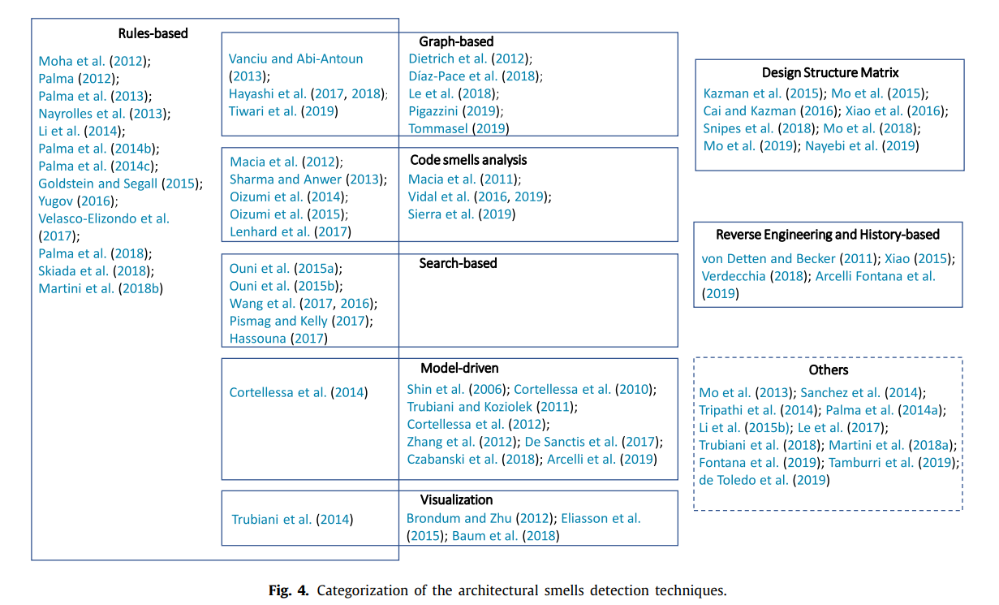
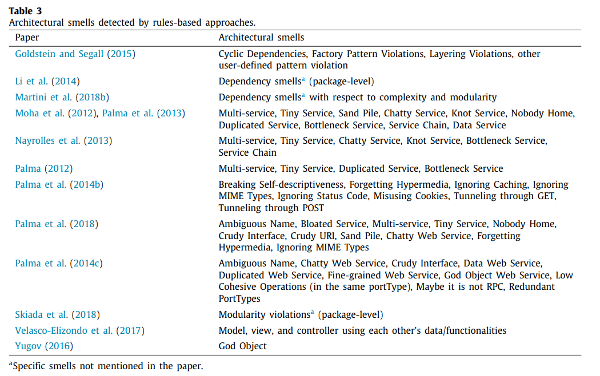
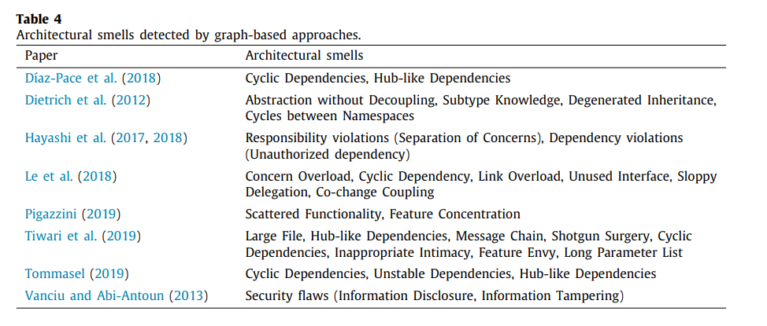
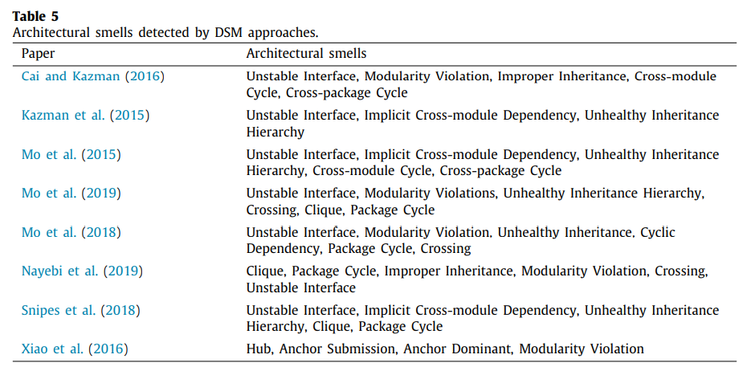
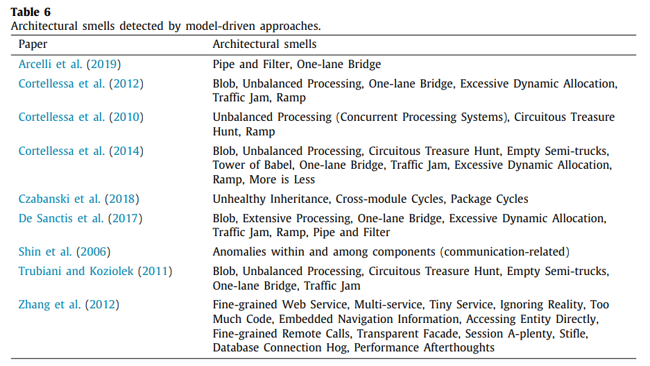
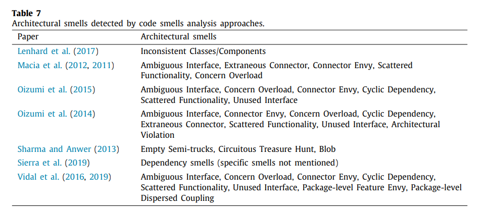
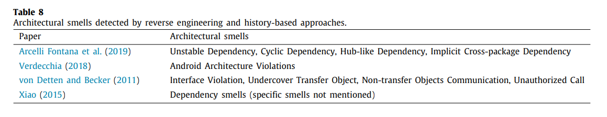
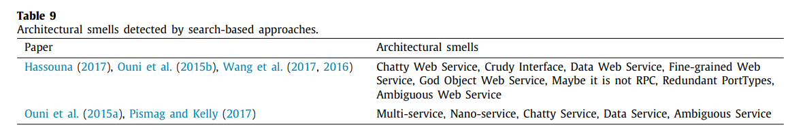
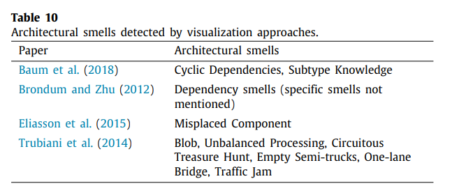
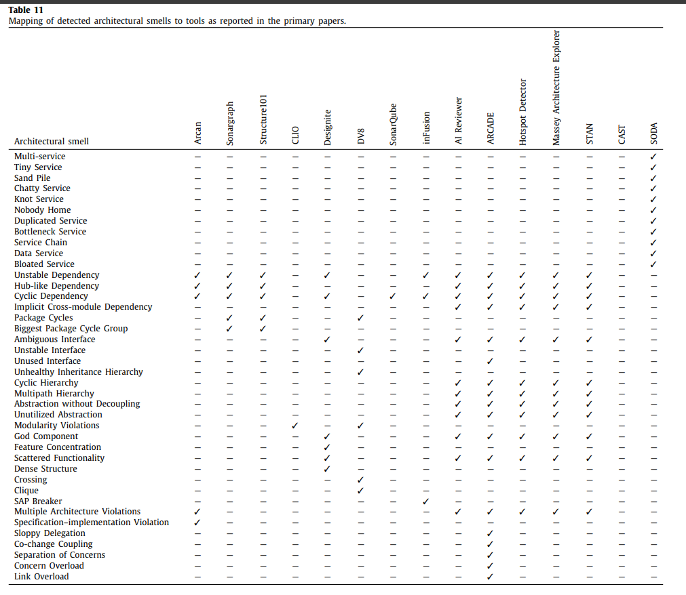

# JSS 论文整理

## 1. 相关概念

### 1.1 **Smell**  

软件开发过程中遇到的架构问题.  与antipattern, flaw, anomaly 一样,包括三个architecture, design, implementation从高到低三个level,文章主要专注于architecture level

### 1.2 **Architectural Technical Debt (ATD) 技术债**  

交付第一次代码就像陷入债务。 债务是可以加快开发速度，只有通过重写代码，及时偿还债务。如果不偿还债务，就会发生危险。 把时间花在写一些不正确的代码上的每一分钟都算作该债务的利息。 整个软件项目可能在未合并代码的部署，面向对象设计或其他方面的债务问题而陷入停顿。(Ward Cunningham)

这种隐喻和金融债务非常类似，这也是这个隐喻的高明之处：为了解决短期的资金压力，获得短期收益，个人或企业向银行或他人借款，从而产生债务，这种债务需要付出的额外代价是利息。

如果短期商业的投资所带来的收益大于利息，这也许是一种明智的做法，但如果入不敷出，收益不及债务产生的利息就会导致资产受损。虽然长期来看这种投资仍然有可能扭亏转盈，但是整个过程风险很大，随时会导致个人或企业破产。

### 1.3 论文大概和研究的问题

JSS整理了之前一些关于architectural smell detection论文，分析他们的一些**基本发布信息**， **所采用的的techniques** , **所采用的的tool**， **相关的limitation**，分析各种technique，tool针对哪种smell，他们是如何验实的等等。

## 2. 和architecture相关的一些概念  

1. **Technique Styles**
   1. Rules-based  
    用已有的指标和阈值(metric and threshold)和已经已有的框架，探索步骤和知道步骤(framework, heuristics, guidelines)来探测一些架构问题。这种风格最常用  
   2. Graph-based  
    把系统某个成分或实体当成node，他们之间的关系当成edge，用图来表示架构各个实体及其关系。
   3. Design structure matrix (DSM)  
    用二维矩阵来表示软件架构的各种关系，常用来设计管理复杂系统。
   4. Model-driven  
    通过抽象概念和建模(abstraction and modeling) 来表示系统的架构和各种行为
   5. Code smell analysis  
    关注于如何从源代码的smell来检测软件架构中的smell
   6. Reverse engineering and history-based  
    Reverse engineering: 通过现有的软件系统来推测其设计与架构，以及其相关生产过程  
    History-based: 理解软件架构的模式和改动
   7. Search-based  
    把软件工程的问题转为可计算的寻找问题(computational search problem),以元探索式的方式(metaheuristic)来解决
   8. Visualization  
    把架构smell检测可视化，从而有助于大型软件系统的理解
   9. Others  
(各种style具体如何实现见论文)

2. **Architecture style**  
即各种常见架构的种类  
    1. Service-oriented 
    2. Model-View-Controller(MVC)
    3. Layered
    4. Component 
    5. Cloud
    6. Client-server
    7. C-language
    8. Java EE
    9. Android
    10. Aspect-oriented

3. **Architecture Smell**  
    Serviced-oriented, performance, dependency, package 等等，具体见论文附录

4. **Validation Type**  
   各论文是如何证实其方法技巧的，主要分为empirical study和case study两类

5. **Quality characteristics**  
   各论文的性能分析，包括maintainability, performance, security等方面

更多信息见论文第四部分Analysis framework

## 3. 主要（有用）成果

### 1. 各论文中其使用的technique style的分类

### 2. 各论文使用的technique其检测的smell的分类

Rule-based 类

Graph-based 类

DSM 类

model-driven类

code smell analysis类

reverse engineering and history-based类

search-based类

visualization类  

### 3. 各tools可检测到的smell

