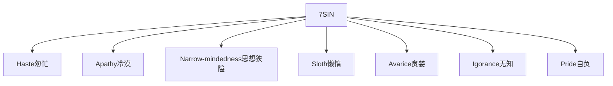
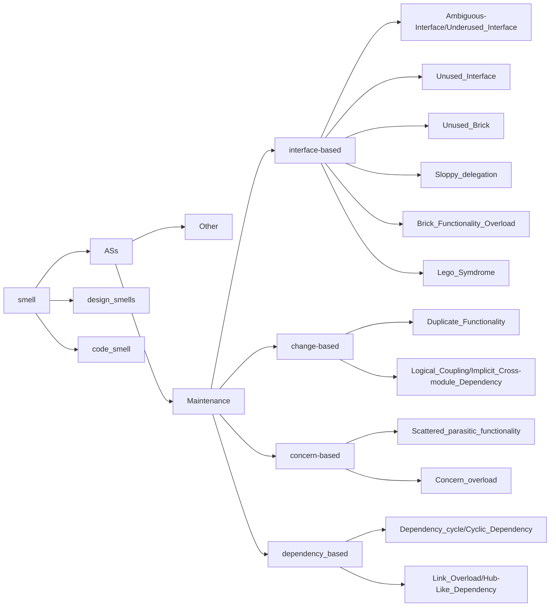
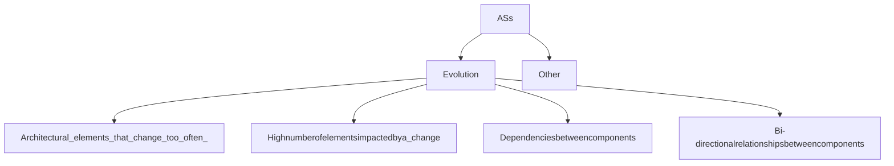

# MINDMAP

## Map: Reason of all anti-pattern

seven sin



### Old School Def of ASs

mainly view from Architects' point

```mermaid
graph LR

```


### Smell's formal classification


### detail:


​	


